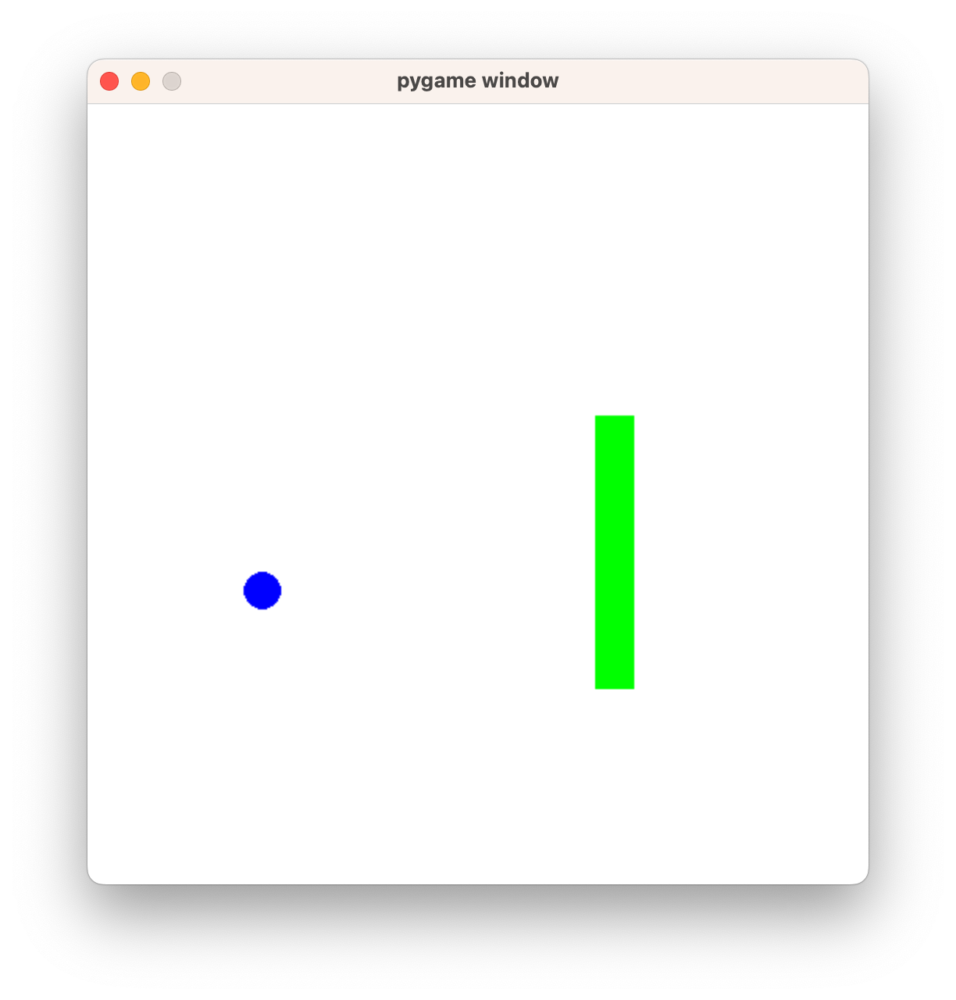

# Snake game in Python

Last tested in Python 3.9.6 and pygame 2.5.2



The game was created as an example for the book Python od podstaw, by Marcin Moskała. 

## How to play

Start `game.py` with Python with a version over 3

```bash
python game.py
```

or

```bash
python3 game.py
```

To move the snake use the arrow keys. Catch the blue dots to grow the snake. If the snake hits itself, the game is over and starts again.

## Folders

Folder `1-daj-mi-okno-na-swiat` and `2-zmiana-stanu` present intermediate steps of creating the game. 
